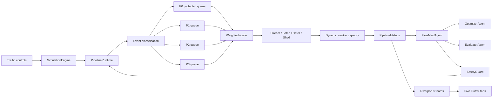

# AdaptQ Jury Presentation Guide

## 1. One-minute pitch

AdaptQ is an adaptive data-pipeline command center for flash-sale traffic. It separates incoming work by business priority, protects payments and orders from noisy neighbors, and changes stream, batch, defer, or shed behavior as queue pressure changes.

The demo is a deterministic local simulation, so the jury can reproduce every result without a cloud account or external API. The app shows the complete control loop: synthetic events are generated, classified, queued, routed, processed by a dynamic worker pool, measured, and then used by FlowMind to tune the next policy.

> During a 20x surge, AdaptQ keeps P0 payment and order events on protected streaming lanes, batches lower-priority work, defers activity when pressure rises, and samples low-value logs. The result is an observable pipeline that degrades intentionally instead of failing randomly.

## 2. What to say about the logo and product

AdaptQ uses the Q mark as a visual metaphor for a controlled queue: an open path through a constrained system. The app opens directly into the command center and uses five tabs only:

- Dashboard: live health and surge controls
- Events: individual event trace and status
- FlowMind: autonomous decision loop and policy history
- Pipeline: topology, queues, and worker flow
- Analytics: latency, throughput, pressure, and cost trends

There is no voice assistant, phone-call integration, emergency-call workflow, or external Bland AI dependency.

## 3. Architecture



### Main layers

| Layer | Responsibility | Implementation |
|---|---|---|
| Presentation | Dashboard, event stream, agent state, topology, analytics | `lib/features/` |
| State bridge | Exposes live metrics, queues, events, decisions, and agent state | `lib/providers/`, `lib/services/mock_realtime_service.dart` |
| Repository | Keeps UI independent from the simulator or future backend | `lib/repositories/` |
| Control loop | Observe, evaluate, propose, validate, execute, verify | `lib/agent/flowmind_agent.dart` |
| Runtime | Generates events, maintains queues, routes work, computes metrics | `lib/simulation/pipeline_runtime.dart` |
| Safety | Rejects unsafe policies, especially critical-workload shedding | `lib/agent/safety_guard.dart` |
| Decision function | Scores priority, queue size, latency, load, data size, and cost | `lib/simulation/adaptive_processing.dart` |

## 4. Complete data workflow

### Step 1: Traffic is created

The Dashboard traffic control sets a rate such as 1,000, 20,000, or 100,000 events/minute. `SimulationEngine` runs a one-second tick. `PipelineRuntime` converts the rate into synthetic events per second with small jitter so the display feels live while remaining local and reproducible.

Synthetic event classes are selected by weighted probability:

- `payment.webhook.charge`
- `order.fulfillment.created`
- `inventory.warehouse.sync`
- `activity.user.clickstream`
- `system.telemetry.debug_log`

Each generated event receives an ID, event type, timestamp, payload size, and processing metadata.

### Step 2: Events are classified

`ClassificationConstraints` applies deterministic domain rules. Payments and orders become P0, inventory becomes P1, activity becomes P2, and telemetry/logs become P3. This classification is deliberately separate from the adaptive agent: the control loop may tune processing, but it cannot reinterpret the business criticality of an event.

### Step 3: Events enter isolated queues

The runtime increments one queue depth per priority. P0 lanes are protected from sampling and shedding. Non-critical lanes can be deferred or sampled according to the active policy. Every important state change becomes a recent `PipelineEvent` for the Events tab.

### Step 4: Routing is scored

For each queue, `ProcessingDecisionFunction` computes a weighted urgency score:

```text
score = 0.30 priority
      + 0.20 queueSize
      + 0.20 latency
      + 0.15 workerLoad
      + 0.05 dataSize
      + 0.10 processingCost
```

Routing behavior:

- Critical priority: stream immediately
- High weighted pressure: micro-batch
- Moderate pressure: defer
- Low pressure: stream

The score and explanation are exposed to the simulator and FlowMind views, so the decision is inspectable rather than a hidden threshold.

### Step 5: Workers process the queues

Worker capacity is calculated from the active policy and queue depth. As the queue grows, the runtime increases workers up to a bounded ceiling. Batch lanes process more events per worker; stream lanes preserve low latency. The runtime records throughput, latency, worker utilization, queue pressure, deferred events, and shed events.

### Step 6: FlowMind closes the loop

After each runtime tick, `FlowMindAgent` observes the metrics. The Optimizer proposes new constraints when the traffic condition changes. `SafetyGuard` validates the proposal. If approved, it is applied to the runtime. The Evaluator compares post-change metrics against a checkpoint and rolls back a policy that harms the P0 SLA.

The loop is:

```text
Observe -> Analyze -> Propose -> Safety validate -> Execute -> Verify -> Recover or adjust
```

### Step 7: The UI receives live state

`MockRealtimePipelineService` converts the engine streams into Riverpod streams. The five tabs subscribe independently:

- Dashboard reads metrics, queues, and agent state.
- Events reads the recent event stream.
- FlowMind reads agent summaries and decision history.
- Pipeline reads metrics and renders the stage topology.
- Analytics reads metrics and renders time-series charts.

## 5. Reliability and cost demonstration

Open the What-If Simulator from the app’s available simulator entry point and run the scenario. It demonstrates:

1. Twelve event IDs enter a payment-like workload.
2. One worker is killed while processing event five.
3. Only event five is retried.
4. The idempotency set rejects the duplicate side effect.
5. Queue depth increases the worker count temporarily.
6. Adaptive worker cost is compared with a naive always-scale-up pool.
7. The weighted strategy changes when queue pressure, latency, or worker load changes.

The important jury statement is: **retry is scoped to the failed event, while the side-effect ledger prevents double processing.**

## 6. Recommended live demo script

### 0:00-0:30: Baseline

Open Dashboard. Point out the current event rate, healthy P0 latency, queue pressure, worker utilization, and zero critical loss.

Say: “This is the normal operating state. The system is already separated into priority lanes before any adaptive decision is made.”

### 0:30-1:00: Create the surge

Move traffic from 1,000 to 20,000 events/minute. Show the metrics changing and then open Pipeline.

Say: “The spike does not make every event equally urgent. The runtime keeps P0 payment and order work isolated while lower-priority traffic becomes a candidate for batching or deferral.”

### 1:00-1:30: Explain the decision

Open FlowMind. Show the current state, optimizer action, decision history, and SafetyGuard result.

Say: “FlowMind is a closed-loop controller. It observes the outcome of a policy change, and the Evaluator can roll it back if the P0 SLA degrades. The mathematical safety layer is the final authority.”

### 1:30-2:00: Prove the workflow

Open Events and point out processed, deferred, shed, and queued events. Then open Analytics.

Say: “The dashboard is not only a control surface. Every decision produces telemetry, so we can explain why a strategy changed and compare throughput, latency, pressure, and cost.”

### 2:00-2:30: Show reliability and cost

Run the What-If reliability scenario.

Say: “A worker failure retries only the event that was in flight. The idempotency key prevents a duplicate side effect. At the same time, workers scale with queue depth instead of running at the maximum all the time.”

### 2:30-3:00: Recover

Return traffic to baseline.

Say: “When pressure falls, the system returns toward streaming behavior and drains deferred work. The key design choice is intentional degradation: protect business-critical events first, then spend capacity on the rest.”

## 7. Jury questions and concise answers

### Is this a real production backend?

This build is a local simulator and control-plane prototype. It intentionally models the contracts needed for production: repository abstraction, priority queues, policy decisions, metrics, safety validation, and an observable UI. A Kafka/Flink implementation can replace the mock repository without changing the presentation layer.

### Why not just add more workers?

More workers do not solve head-of-line blocking or distinguish payment events from logs. AdaptQ routes by business priority first, then scales workers according to queue depth and strategy.

### Is the agent allowed to make unsafe changes?

No. The Optimizer proposes. SafetyGuard validates. The Evaluator observes the result and can roll back. Critical P0 processing cannot be intentionally shed by an accepted policy.

### Are P2 and P3 events silently lost?

P2 is deferred and counted. P3 can be sampled under policy, and the UI exposes the shed count. Critical event loss is tracked separately and remains zero in the protected simulation path.

### Where does the input data come from?

The demo generates synthetic events locally. This makes the jury demo deterministic and offline. In production, the same repository contract can be backed by Kafka, webhooks, or another event broker.

## 8. Honest scope statement

AdaptQ is a functional simulation and command-center prototype. Its value is the demonstrated control logic and observability: priority isolation, weighted routing, policy validation, dynamic capacity, retry/idempotency modeling, and adaptive cost comparison. Production deployment would add durable queues, transactional sink APIs, distributed idempotency storage, real worker processes, and broker integration behind the existing repository boundary.

## 9. Verification commands

```powershell
flutter test
flutter analyze
flutter build apk --release
```

The generated Android artifact is:

```text
build/app/outputs/flutter-apk/app-release.apk
```
